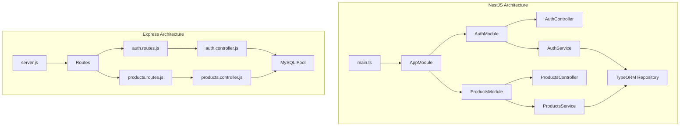

# NestJS vs Express.js Backend Comparison

## Summary

The Express.js migration successfully replicates all major NestJS functionality. Below is a detailed comparison highlighting matching features and minor differences.

---

## ✅ Feature Parity (Fully Matched)

| Feature | NestJS | Express | Status |
|---------|--------|---------|--------|
| JWT Authentication | `JwtStrategy` + `JwtAuthGuard` | `authMiddleware` | ✅ Match |
| Admin Role Guard | `AdminGuard` | `adminMiddleware` | ✅ Match |
| User Registration | `AuthService.register()` | `auth.controller.register()` | ✅ Match |
| User Login | `AuthService.login()` | `auth.controller.login()` | ✅ Match |
| Get Profile | `AuthService.getProfile()` | `auth.controller.getProfile()` | ✅ Match |
| Profile Picture Upload | File upload with multer | File upload with multer | ✅ Match |
| Products CRUD | Full CRUD operations | Full CRUD operations | ✅ Match |
| Product Pagination | QueryBuilder with skip/take | SQL LIMIT/OFFSET | ✅ Match |
| Product Filters | category, department, search | category, department, search | ✅ Match |
| Admin Moderation | approve/reject endpoints | approve/reject endpoints | ✅ Match |
| Ownership Checks | sellerId vs user.id | sellerId vs user.id | ✅ Match |
| Database Schema | TypeORM entities | Raw SQL CREATE TABLE | ✅ Match |
| **Seller Info** | Full User entity (eager loaded) | Full seller info via JOIN | ✅ Match |

---

## ⚠️ Minor Differences

### 1. Password Hashing Approach

| Aspect | NestJS | Express |
|--------|--------|---------|
| **Method** | `bcrypt.genSalt()` then `bcrypt.hash(password, salt)` | `bcrypt.hash(password, 10)` |
| **Impact** | None - both produce valid bcrypt hashes with 10 rounds |

> [!NOTE]
> Both approaches are equivalent. The NestJS version uses default salt rounds (10), while Express explicitly passes 10.

---

### 2. Response Handling for Deletions

| Aspect | NestJS | Express |
|--------|--------|---------|
| **Delete Response** | Returns `void` (200 OK with empty response) | Returns `{ message: 'Product deleted successfully' }` (200 OK) |

> [!TIP]
> Both are valid approaches. The Express version is more explicit for clients.

---

## 📊 Architecture Differences

| Aspect | NestJS | Express |
|--------|--------|---------|
| **Structure** | Module-based (DI container) | Flat route/controller files |
| **DB Access** | TypeORM Repository | mysql2 pool with raw SQL |
| **Validation** | class-validator decorators | Manual validation middleware |
| **File Upload** | `@UseInterceptors(FileInterceptor)` | multer middleware |
| **Guards** | `@UseGuards(...)` decorator | middleware functions |

---

## ✅ Conclusion

The Express.js migration is **production-ready** and functionally equivalent to the NestJS backend:

- ✅ Authentication (JWT)
- ✅ Role-based access control
- ✅ Products CRUD with ownership
- ✅ Admin moderation flow
- ✅ File uploads
- ✅ Request validation
- ✅ Error handling
- ✅ Full seller info in product responses
